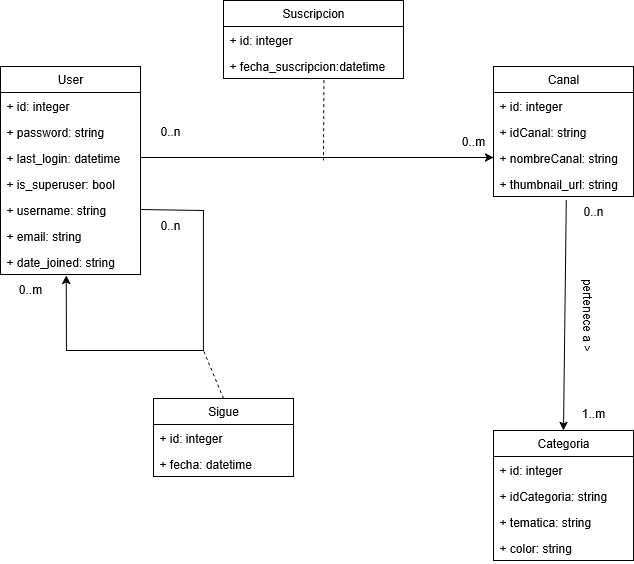
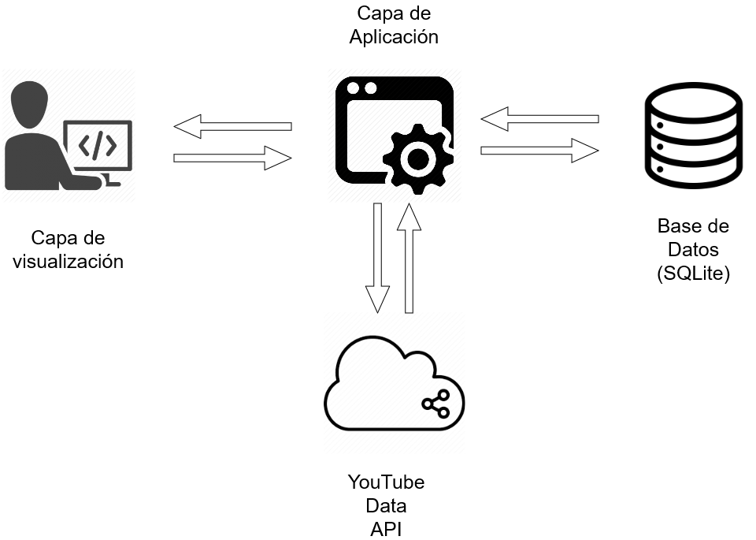

# FriendScriptions
## Integrantes:
- Gilardoni, Lucio - 51189
- Godoy, Marcos José - 51192
- Márquez, Matías Tomás - 51419
## Descripción del proyecto

FriendScriptions es una aplicación web diseñada para que los usuarios de 
YouTube descubran canales y conecten con otros usuarios a través de sus 
gustos compartidos. La aplicación permite a los usuarios iniciar sesión de 
forma segura con su cuenta de Google y sincronizar automticamente sus 
suscripciones de YouTube.

Una vez logueado, el usuario tiene acceso a un perfil con un
dashboard que visualiza la distribución de sus intereses a través de un 
gráfico. La principal función social de la aplicación es la capacidad de 
seguir a otros usuarios y comparar perfiles. Al hacerlo, FriendScriptions 
calcula un "porcentaje de compatibilidad", mostrando de forma clara y rápida 
qué tan alineados están sus gustos en YouTube.

Además, la aplicación cuenta con un motor de recomendaciones que sugiere 
nuevos canales para descubrir. Estas recomendaciones se basan en dos fuentes 
principales: los canales populares entre los usuarios que sigue y las 
categorías de contenido que más consume, incentivando así la exploración de 
contenido relevante. 

### Objetivos
- Crear una herramienta que permita a los usuarios descubrir contenido 
nuevo y relevante en YouTube a través de la comparación de sus suscripciones 
con las de otros usuarios con gustos similares.
- Ofrecer a los usuarios una visualización clara de sus propios 
  hábitos de consumo en YouTube, ayudándolos a entender mejor sus intereses.
- Fomentar una comunidad de usuarios al facilitar la conexión entre personas 
  con afinidades de contenido, utilizando la compatibilidad como un punto de 
  partida para la interacción social.

### Alcance
- Autenticación de usuarios exclusivamente a través de Google OAuth 2.0
- Importación y almacenamiento de la lista de suscripciones de YouTube del 
  usuario
- Funcionalidad para seguir y dejar de seguir a otros usuarios registrados en 
  la aplicación.
- Cálculo y visualización del porcentaje de compatibilidad de suscripciones 
  entre usuarios.
- Dashboard de perfil con visualización gráfica de la distribución de 
  categorías de canales.
- Generación de recomendaciónes de nuevos canales basadas en la actividad 
  personal y de usuarios seguidos.
- Página de búsqueda simple para encontrar a otros usuarios por su nombre de 
  usuario.

## Modelo de Dominio

## Bosquejo de Arquitectura

 

## Requerimientos

### Funcionales

- RF1: Autenticación de Usuario con Google: El sistema debe permitir a un nuevo usuario registrarse y a un usuario existente iniciar sesión utilizando únicamente su cuenta de Google.
- RF2: Sincronización de Suscripciones de YouTube: Tras el primer inicio de sesión, el sistema debe solicitar permiso para acceder a las suscripciones de YouTube del usuario y sincronizarlas, almacenando los canales a los que está suscrito.
- RF3: Sistema de Seguimiento de Usuarios: Un usuario autenticado debe poder buscar a otros usuarios de la plataforma y seguirlos o dejar de seguirlos.
- RF4: Cálculo de Compatibilidad: El sistema debe mostrar un porcentaje de compatibilidad entre el usuario autenticado y los usuarios a los que sigue, basado en la cantidad de suscripciones de YouTube que tienen en común y las categorías a los que dichos canales pertenecen.
- RF5: Visualización de Dashboard de Perfil: Cada usuario debe tener un dashboard en su perfil que muestre un gráfico con la distribución porcentual de las categorías de los canales a los que está suscrito.
- RF6: Recomendación de Canales: El sistema debe listar canales recomendados para el usuario basándose en los canales de sus usuarios seguidos y en la distribución porcentual de las categorías de los canales a los que está suscrito. 

### No Funcionales

### Portability

- El sistema debe funcionar correctamente en múltiples navegadores y formatos de pantalla.

### Security

- Todas las contraseñas deben guardarse con encriptado criptográfico (SHA o equivalente).
- Todos los Tokens / API Keys o similares no deben exponerse de manera pública.

### Maintainability

- El sistema debe diseñarse con la arquitectura en 3 capas. (Ver [checklist_capas.md](checklist_capas.md))
- El sistema debe utilizar control de versiones mediante GIT.
- El sistema debe estar programado en Python 3.8 o superior.

### Scalability

- El sistema debe funcionar desde una ventana normal y una de incógnito de manera independiente.
  - Aclaración: No se debe guardar el usuario en una variable local, deben usarse Tokens, Cookies o similares.

### Performance

- El sistema debe funcionar en un equipo hogareño estándar.

### Flexibility

- El sistema debe utilizar una base de datos SQL

## Stack Tecnológico

### Capa de Datos

#### Base de Datos
Usamos SQLite porque nos pareció adecuada para un proyecto con un tráfico 
esperado bajo y su rendimiento sería suficiente, además su simplicidad 
facilita el despliegue y las copias de seguridad, siendo una opción robusta 
y económica para este caso de uso
#### ORM
Elegimos usar Django ORM porque viene incluído en Django y permite interactuar 
con la base de datos usando código Python en lugar de sentencias SQL. 
Además, permite la facil migración entre motores de base de datos en caso 
de que surja la necesidad de cambiar de solución ante un aumento en el 
tráfico o si se añaden funcionalidades más complejas que así lo requieran. 

### Capa de Negocio

#### Framework 
Como framework base usamos Django porque sigue la filosofía de "baterías 
incluidas", ofreciendo un sistema de autenticación, un panel de  
administrador y un ORM ya integrado, lo que acelera y facilita el desarrollo.

Algunos de los paquetes python y librerías utilizadas son: django; 
django-allauth; google-api-python-client; google-auth-oauthlib 

#### APIs
- Google OAuth. Para el inicio de sesión con Google.
- Youtube Data API. Para la obtención de los datos de YouTube.

### Capa de Presentación

En la capa de presentación elegimos usar el motor de plantillas de Django 
por su integración con el backend y la simplicidad que aporta al ciclo de 
desarrollo. Ofrece un enfoque más directo y rápido, ya que evita la 
complejidad de construir y mantener una API REST y una aplicación de 
frontend separada.
## Ejemplo de Caso de Uso
[Caso de Uso Comparación](./docs/CU_FriendScriptions.pdf)